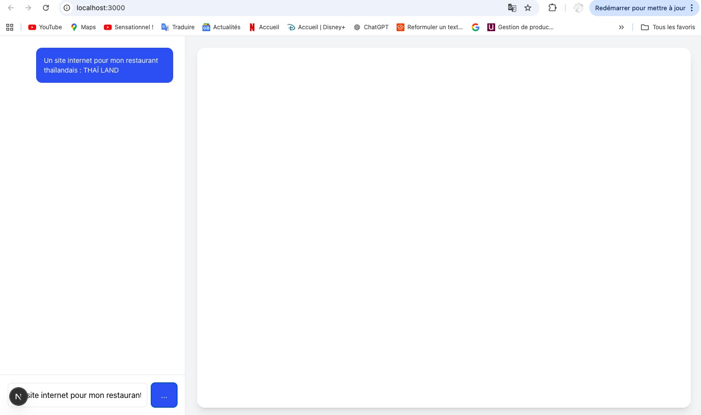
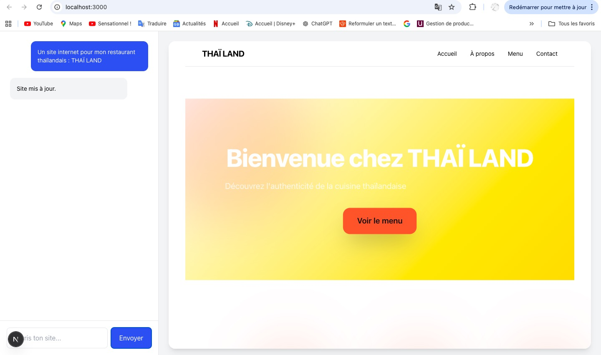
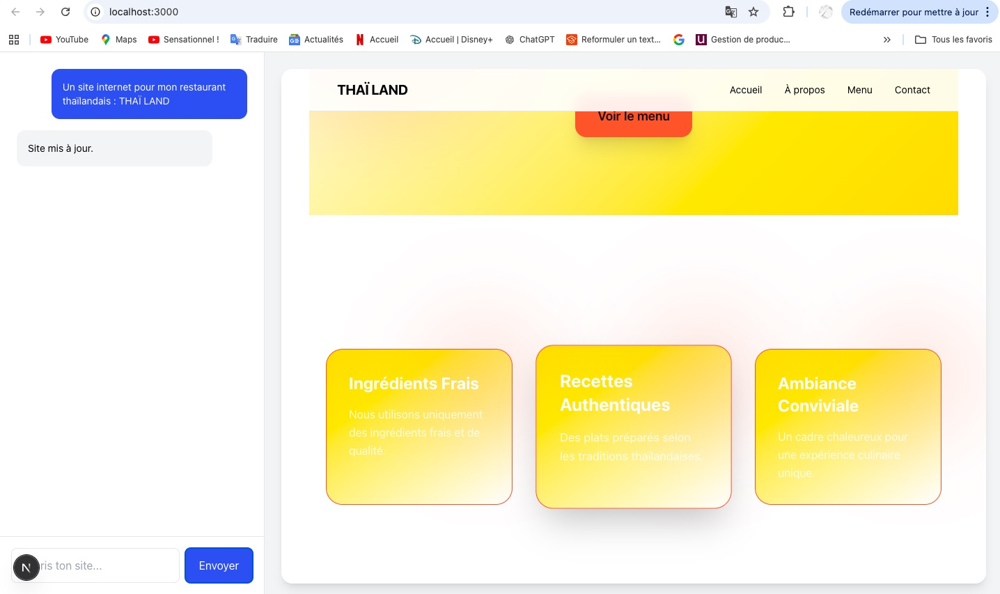
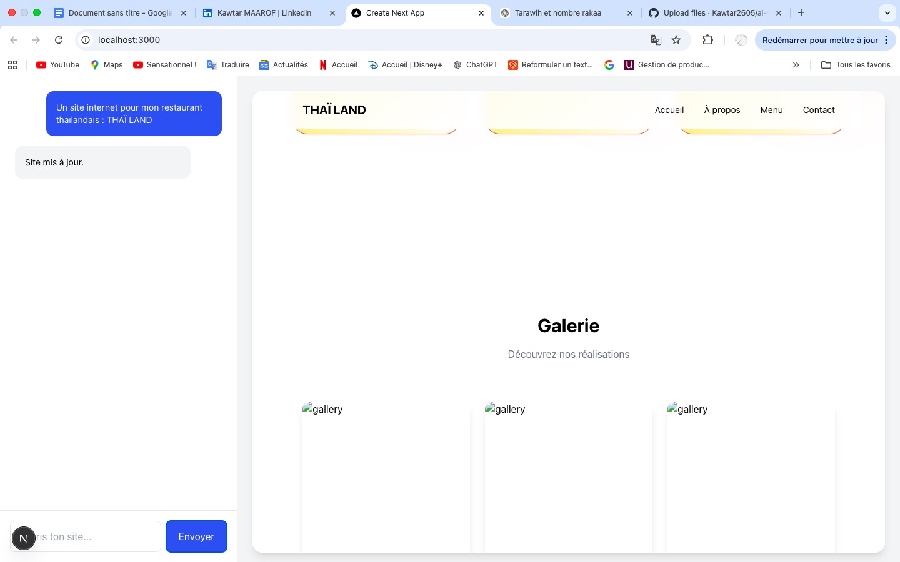
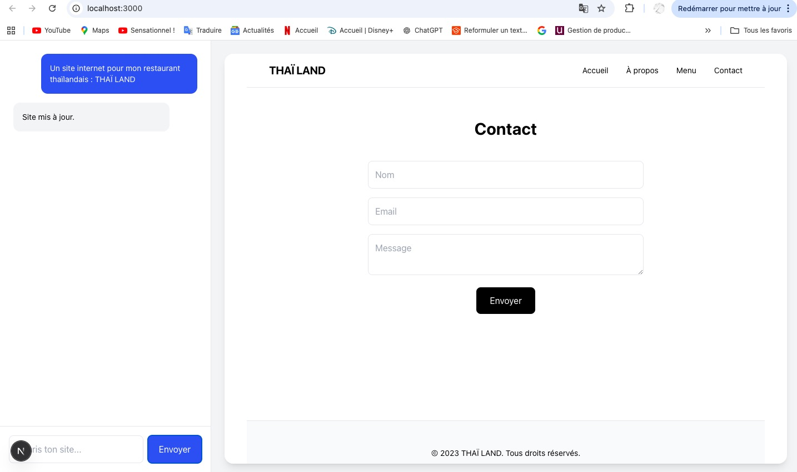
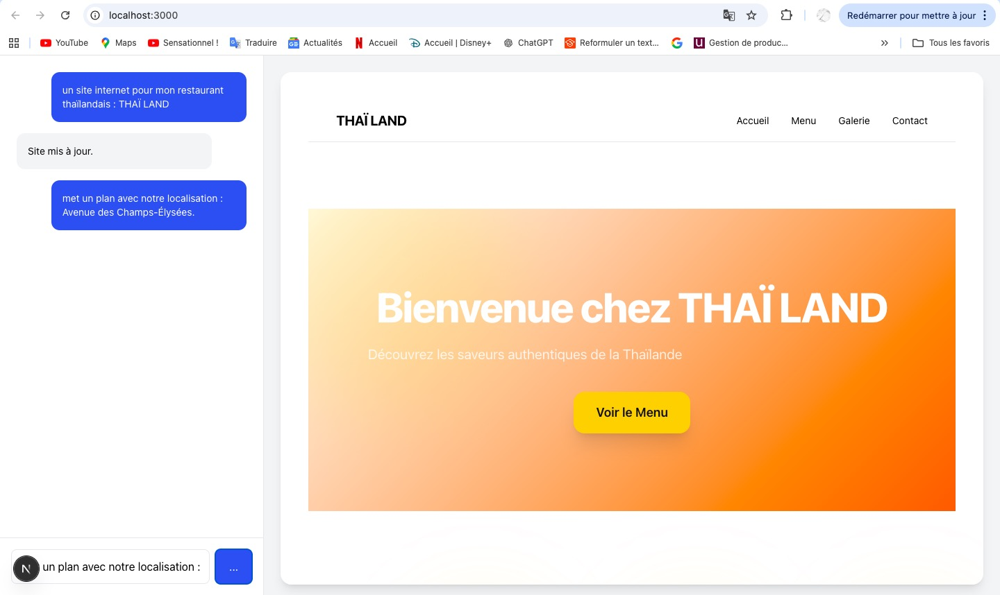
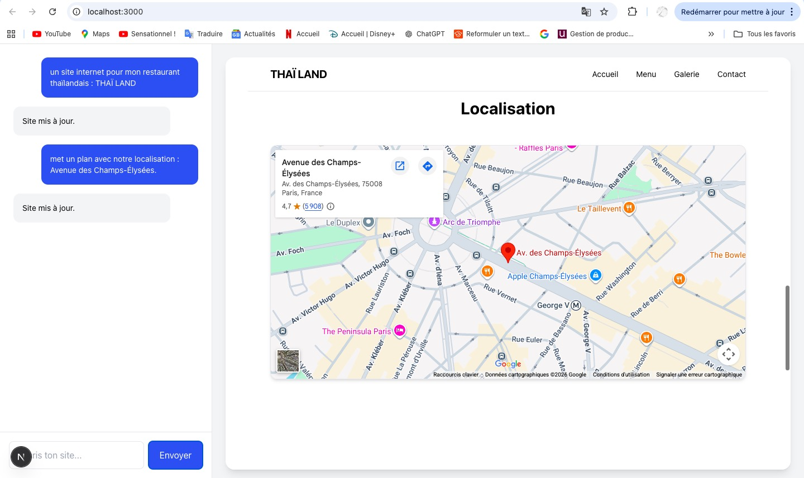

## Demo

Ce dépôt inclut une démonstration du projet sous deux formats : une version vidéo et une version illustrée par captures d’écran montrant l’évolution du site généré.

### Génération d’un site web à partir d’un prompt utilisateur

![Demo principale] (https://drive.google.com/file/d/1Rhv8HNxTYlvV0Jqq3s0306MPedK-o66q/view?usp=sharing))

### Évolution du site généré

Agent IA capable de générer dynamiquement la structure d’un site web à partir d’un besoin exprimé en langage naturel.

## Objectif du projet

Explorer comment l’intelligence artificielle peut transformer une expression de besoin métier en solution digitale structurée.

À partir d’un simple prompt utilisateur, le système génère dynamiquement une architecture de site web exploitable et l’affiche dans une interface interactive.

---

## Démonstration

Exemple de prompt :

"Je veux un site internet pour mon restaurant thaïlandais avec un design asiatique et des couleurs chaudes."

Le système génère automatiquement :

- une navigation
- une page d’accueil
- une section menu
- une galerie
- un formulaire de contact

Le site est rendu dynamiquement dans un canvas interactif.

---

## Fonctionnement

Le projet repose sur une architecture simple :

Prompt utilisateur  
↓  
Interface conversationnelle  
↓  
Appel à l’API OpenAI  
↓  
Génération d’une structure normalisée (JSON)  
↓  
Interprétation côté front-end  
↓  
Rendu dynamique du site web

---

## Stack technique

- Next.js
- TypeScript
- OpenAI API
- JSON
- VS Code

---

## Architecture

Input utilisateur (prompt libre)

↓

Interprétation par un modèle de langage (LLM)

↓

Génération d'une structure de site

↓

Transformation en interface web interactive

---

## Réflexion transformation digitale

Ce projet s’inscrit dans une réflexion plus large autour de :

- l’automatisation intelligente
- la structuration des besoins métier
- la transformation digitale assistée par IA

Il illustre comment les modèles de langage peuvent être utilisés pour :

- interpréter un besoin exprimé en langage naturel
- structurer une solution digitale
- accélérer la conception de produits numériques.

---

## Positionnement

Ce projet est un **prototype exploratoire** visant à comprendre comment l’IA peut être intégrée dans des processus de conception digitale.

Il met l’accent sur :

- la structuration du besoin
- la modélisation
- l’automatisation de la conception digitale.
